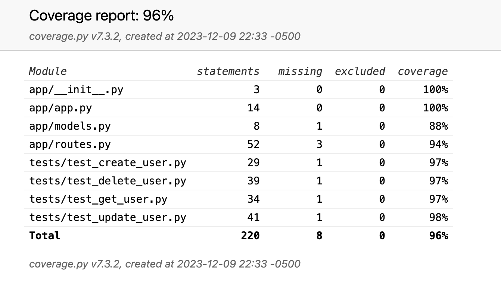
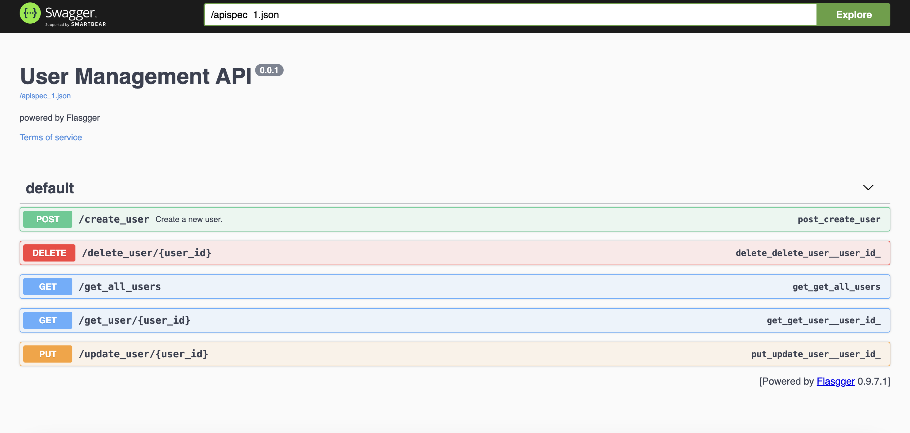

# bnka-solid-test
Pasos para correr flask
pip3 no está instalado por defecto. Solo está disponible si has instalado una versión personalizada de pip3.

Instalar dependencias
### `pip3 install -r requirements.txt`

Es una buena práctica crear un entorno virtual para aislar las dependencias del proyecto.
### `python -m venv venv`

Activar el entorno virtual:
Unix o MacOS
### `source venv/bin/activate`
Windows
### `venv\Scripts\activate`

Ejecutar aplicacion
### `flask run`

Ejecutar los test unitarios
### `python3 -m unittest discover tests`

Ejecutar los test unitarios con cobertura
### `coverage run -m unittest discover tests`

Generar reportes
### `coverage report -m`

Generar reportes en HTML
### `coverage html`

Pasos para correr react project (abrir otra terminal del proyecto)
### `cd user-management-app`

Crear archivo .env en la raiz del proyecto react y crear variable

REACT_APP_BACKEND_API=http://127.0.0.1:5000

Instalar dependencias
### `npm install`

Ejecutar react app
### `npm run start`

Resultado de los tests

Para probar los endpoints a través de una interfaz, estoy usando Swagger
y se puede ubicar en la ruta http://127.0.0.1:5000/swagger/#/

